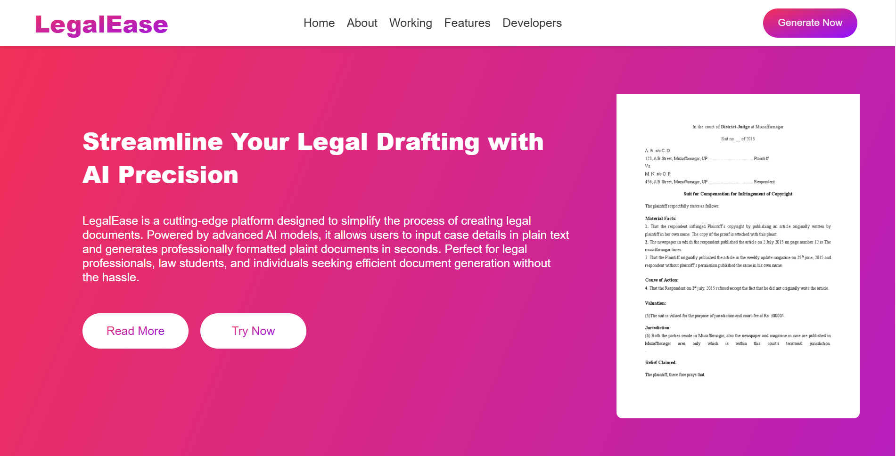

# Legal-document-Generator

# 🏛️ Litigaide - AI-Powered Legal Document Generator

Litigaide is an AI-powered legal document generator that helps users create well-structured plaint documents based on their case details. This tool simplifies the legal drafting process using NLP and machine learning, making legal documentation accessible and efficient.

## 🚀 Features
- 📝 **AI-Based Plaint Generation**: Generates plaint documents based on user input.
- 📄 **Download as PDF**: Converts the generated plaint into a downloadable PDF.
- 📑 **Database Storage**: Saves generated documents for future reference.
- ⚡ **Fast and Secure**: Built with FastAPI for a high-performance backend.
- 🌐 **User-Friendly UI**: Developed using React.js for seamless interaction.

---

## 📷 Screenshot  

---

## 🛠️ Tech Stack
- **Frontend**: React.js (Axios for API requests)
- **Backend**: FastAPI (Transformers for AI model, ReportLab for PDF generation)
- **Database**: MySQL/PostgreSQL (SQLAlchemy for ORM)
- **AI Model**: 

---

## 🏗️ Installation Guide

### 🔧 Prerequisites
- Node.js & npm installed for frontend
- Python 3.8+ installed for backend
- Virtual environment setup (`venv`)

### Clone the Repository**

bash

git clone https://github.com/your-username/legal-document-generator.git
cd legal-document-generator

## License

This project is licensed under the **Creative Commons Attribution-NonCommercial-NoDerivatives 4.0 (CC BY-NC-ND 4.0)** license.

You may view and download it for personal use, but modifications and commercial use are not permitted without prior permission.

To learn more about this license, visit [Creative Commons CC BY-NC-ND 4.0](https://creativecommons.org/licenses/by-nc-nd/4.0/).
